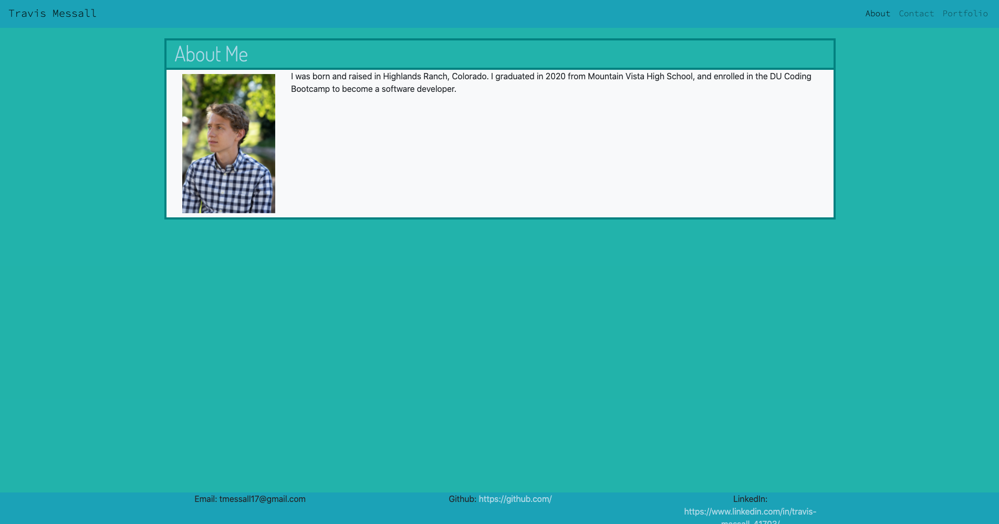
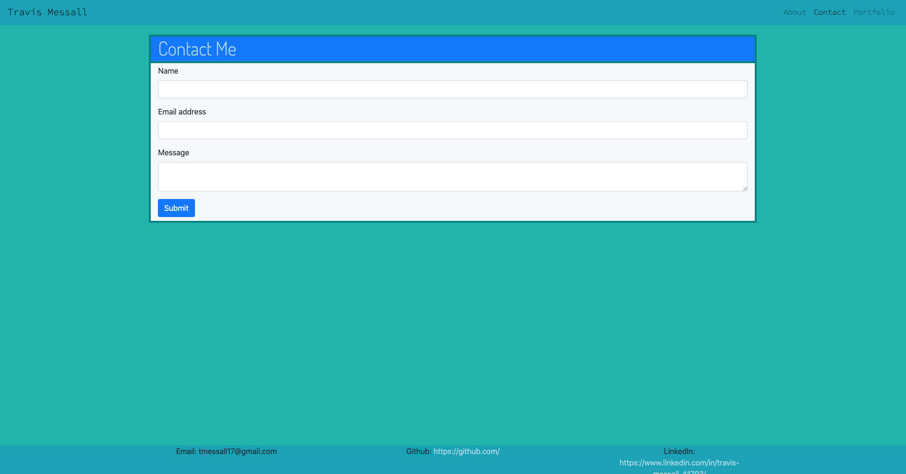
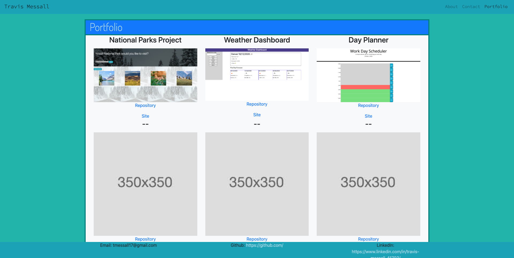

# dubootcampHW02

## Description

This project is essentially a "get to know me" page which I created using HTML, CSS, and Bootstrap. I used Bootstrap for the responsiveness and layout, and CSS for some small styling like font and color. I made this page to showcase myself for potential employers or anyone else who needs to garner some information on me quickly. It consists of 3 separate pages: an About page, a Contact page, and a Portfolio page. The footer on every page contains some additional contact information, including my email as well as my github and linkedin profiles.

### About

This page has a small picture of myself as well as quick description about me. The description is a little bare right now, but I hope to add to it in the future.

### Contact

This page has a form which can be filled out to contact me. However, the javascript is currently not functional to actually be able to contact me (we have yet to learn it).

### Portfolio

This page currently just contains some placeholder images, but one day I hope for it to have pictures and links of true projects that I've done.
